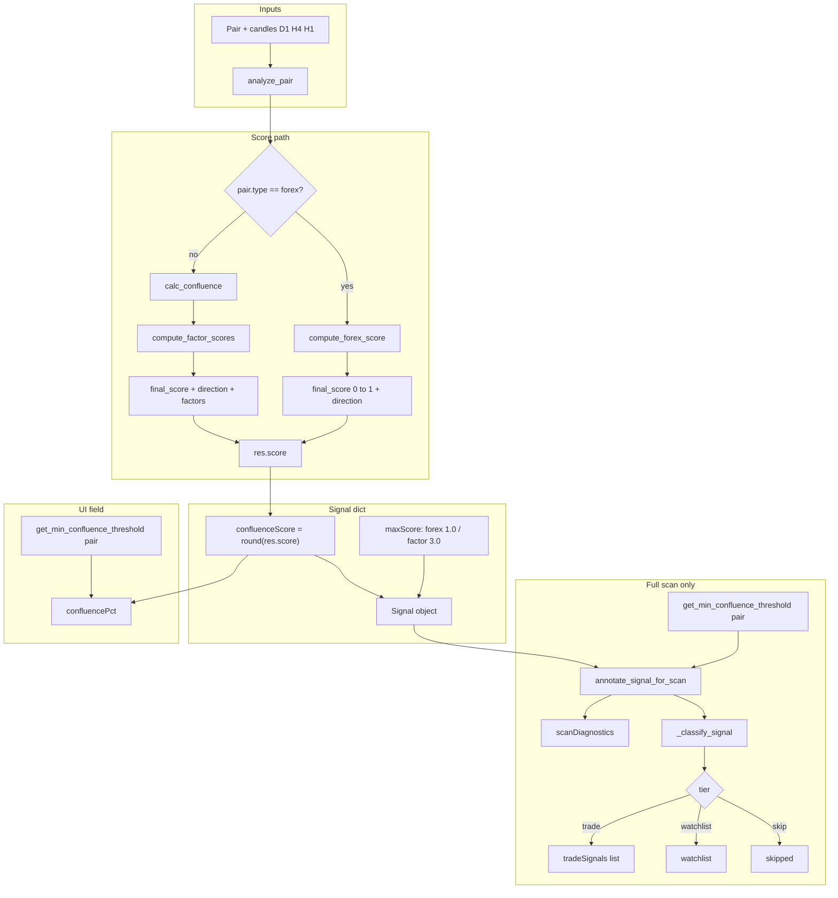

# Engine A — scoring flow (visual reference)

This document mirrors the live code paths. **Engine C and auto-trader are not part of this flow.**

---

## 1. End-to-end flow




**Note:** `annotate_signal_for_scan`, `_classify_signal`, and `tradeSignals` run inside `run_full_scan` in `scanner.py`. Single-pair `analyze_pair` still computes `confluenceScore`, `maxScore`, and `confluencePct`.

---

## 2. Min confluence resolution (`scanThreshold`)

Code: `get_min_confluence_threshold(pair)` in `scoring.py`.

```mermaid
flowchart TD
  A[Pair] --> B{PAIR_PROFILES min_confluence?}
  B -->|yes| U[Use profile value]
  B -->|no| C{MIN_CONFLUENCE_GROUP[type][score_group]?}
  C -->|yes| V[Use group value]
  C -->|no| D[MIN_CONFLUENCE_CLASS[type]]
  D --> E[Else MIN_CONFLUENCE fallback]
```


`**score_group**` from `get_pair_score_group(pair)` (e.g. crypto: `crypto_btc`, `crypto_eth`, `crypto_doge`, `crypto_alt_majors`, `crypto_other`) unless `pair["score_group"]` or profile overrides.

---

## 3. Tier rules (`_classify_signal`)

Code: `scoring.py` — `_classify_signal(signal, pair)`.

`**trade**` — all must hold:

- `pair.enabled`
- not `exchangeClosed`
- not `eventRisk.hardBlock`
- `confluenceScore >= scanThreshold` (threshold from signal’s `scanThreshold`, set in scan from resolver above)

`**watchlist**` — examples:

- Score would pass threshold but **disabled**, **exchange closed**, or **hard event** → watchlist with reasons.
- Else if `trendState != "DEAD RANGING"` and `confluenceScore >= watch_floor`:
  - `watch_floor = max(round(threshold - 0.3, 2), 0.2)`

`**skip`** — everything else.

---

## 4. Score scales (do not mix)


| Branch                               | Engine                                      | `confluenceScore` range (typical) | `maxScore` on signal |
| ------------------------------------ | ------------------------------------------- | --------------------------------- | -------------------- |
| Forex                                | `forex_scoring.compute_forex_score`         | **0–1**                           | **1.0**              |
| Crypto, stock, ETF, commodity, index | `calc_confluence` → `compute_factor_scores` | **0–~3** (formula output)         | **3.0**              |


Factor `final_score` (see `factor_scoring.py`):

`final_score = abs(dir_score) * quality_mult * dir_conf`

with directional confidence from a smooth logistic, not a hard cliff.

---

## 5. `confluencePct` (dashboard meter)

Code: `analyze_pair` in `athena.py` (Dynamic Confluence Scaling comment).

```text
threshold = get_min_confluence_threshold(pair)
confluencePct = min(100, max(0, round((confluenceScore / threshold) * 67)))
```


| Situation                             | Approximate UI  |
| ------------------------------------- | --------------- |
| `confluenceScore == threshold`        | **~67%**        |
| `confluenceScore == 1.49 * threshold` | **~100%** (cap) |


So **low thresholds** make **moderate raw scores** peg **100%** on the bar. This is **not** the same as “% of maxScore 3.0.”

---

## 6. Scan annotation diagnostics

Code: `scanner.py` — `annotate_signal_for_scan`.

Sets `scanDiagnostics` when e.g.:

- `confluenceScore < threshold` → `low_confluence`
- `trendState == "RANGING"` / `"DEAD RANGING"`
- counter-trend warnings, `closed_exchange`, `event_risk`, `inactive_pair`

Funnel counters in `scanFunnel` use these codes.

---

## 7. File map (source of truth)


| Concern                     | File / symbol                                                                             |
| --------------------------- | ----------------------------------------------------------------------------------------- |
| Pair analysis entry         | `athena.py` — `analyze_pair`                                                              |
| Forex vs factor routing     | `athena.py` — `analyze_pair` (~6680–6759)                                                 |
| Factor score + legacy votes | `scoring.py` — `calc_confluence`                                                          |
| `final_score` composition   | `factor_scoring.py` — `compute_factor_scores`                                             |
| Threshold resolver          | `scoring.py` — `get_min_confluence_threshold`                                             |
| Subgroup labels             | `scoring.py` — `get_pair_score_group`                                                     |
| Scan annotate + tier        | `scanner.py` — `annotate_signal_for_scan`, `_classify_signal` import                      |
| YAML thresholds             | `config.yaml` — `MIN_CONFLUENCE_CLASS`, `MIN_CONFLUENCE_GROUP`, `PAIR_PROFILES`, `BT_MIN` |
| Backtest gate parity        | `BT_MIN` should match `MIN_CONFLUENCE_CLASS` per project convention                       |


---

## 8. Related (out of scope for this diagram)

- **Engine C** — manual consensus; does not change `confluenceScore` on Engine A cards.
- **Auto-trader** — uses `tradeSignals` then `_can_execute` (`combinedConviction`, sessions, debate, etc.); `**AUTO_TRADE_MIN_SCORE` is not applied in `_can_execute`** as of current `auto_trader.py`.

---

## 9. Operator table — full `tradeSignals` bands (incl. stocks / indices / commodities)

These are **recommended `MIN_CONFLUENCE` (trade tier)** ranges on the correct scale per asset:

- **Forex:** 0–1 (`confluenceScore` from forex engine).
- **All factor assets** (crypto, stock, ETF, index, commodity): 0–3 (`confluenceScore` from `compute_factor_scores`).

The **second column** in the operator sheet is the **trade** band; the **third** matches code’s watchlist idea `**threshold − 0.3`** (see §3; code also floors watch at `0.2` minimum).


| Asset category                         | Trade band (`MIN_CONFLUENCE`) | ≈ Watch floor (threshold − 0.3) |
| -------------------------------------- | ----------------------------- | ------------------------------- |
| Forex (majors / exotics)               | 0.68 – 0.72                   | 0.38 – 0.42                     |
| Crypto — BTC / ETH                     | 1.65 – 1.85                   | 1.35 – 1.55                     |
| Crypto — Major alts (SOL, XRP, …)      | 1.55 – 1.75                   | 1.25 – 1.45                     |
| Crypto — DOGE / meme / low-cap         | 1.45 – 1.65                   | 1.15 – 1.35                     |
| **Stocks / ETFs / indices**            | **1.75 – 1.95**               | **1.45 – 1.65**                 |
| **Commodities** (oil, gold, natgas, …) | **1.55 – 1.75**               | **1.25 – 1.45**                 |


**Previously missing from the first operator sheet:** stocks/ETFs/indices and commodities (factor 0–3 scale, same as crypto).

---

## 10. Config mapping (when applying §9)

Resolution order is still **profile → `MIN_CONFLUENCE_GROUP` → `MIN_CONFLUENCE_CLASS`** (§2).


| YAML / CONFIG target                                 | Suggested single value (midpoint of band) | Notes                                                                                                         |
| ---------------------------------------------------- | ----------------------------------------- | ------------------------------------------------------------------------------------------------------------- |
| `MIN_CONFLUENCE_CLASS.stock`                         | **1.85**                                  | Mid of 1.75–1.95                                                                                              |
| `MIN_CONFLUENCE_CLASS.index`                         | **1.85**                                  | ETFs/indices use `type: index` or `stock` per pair list                                                       |
| `MIN_CONFLUENCE_CLASS.commodity`                     | **1.65**                                  | Mid of 1.55–1.75                                                                                              |
| `BT_MIN.stock` / `BT_MIN.index` / `BT_MIN.commodity` | Same as class                             | Must match `MIN_CONFLUENCE_CLASS`                                                                             |
| `MIN_CONFLUENCE_GROUP.commodity.*`                   | Scale subgroups into **1.55–1.75**        | e.g. noisier names toward **1.75**, calmer toward **1.55** (`config.py` already lists `nat_gas`, `copper`, …) |
| `MIN_CONFLUENCE_GROUP.stock.*`                       | Scale subgroups into **1.75–1.95**        | e.g. single names toward high end (`us_stock_single`, …)                                                      |
| `MIN_CONFLUENCE_GROUP.index.*`                       | Scale subgroups into **1.75–1.95**        | e.g. `asian_indices`, `us_indices_trackers`, …                                                                |
| `AUTO_TRADE_MIN_SCORE`                               | Align with class for docs                 | Still not read by `_can_execute` unless code changes                                                          |


**ETFs:** In this project they are usually `**type: stock`** (e.g. SPY/QQQ) — they follow `**MIN_CONFLUENCE_CLASS.stock`** and `get_pair_score_group` stock subgroups unless a `PAIR_PROFILES` override exists.

**Implementation status:** `config.yaml` / `config.py` include **crypto, forex, stock, index, commodity** class gates, `BT_MIN`, `MIN_CONFLUENCE_GROUP` subgroups, `AUTO_TRADE_MIN_SCORE` alignment, and XAU/XAG profile thresholds on the factor 0–3 scale.

---

## 11. Optional per-scan quantile gate (`SCAN_QUANTILE_*`)

When `**SCAN_QUANTILE_ENABLED: true`**, `run_full_scan` (only) builds a cross-section of `**confluenceScore`** per `**pair.type**`, then for each class computes a percentile cut from `**SCAN_QUANTILE_TOP_FRACTION**` (e.g. `0.20` → 80th percentile ≈ top fifth of *that scan*).

**Effective threshold** for tiering:

```text
effective = max(static_threshold, quantile_cut)
```

- `**static_threshold**`: same resolver as §2 (`get_min_confluence_threshold`).
- `**quantile_cut**`: skipped if fewer than `**SCAN_QUANTILE_MIN_SAMPLES**` scores in that class for this scan.

Signals carry `**scanThresholdStatic**`, `**scanQuantileCut**`, `**scanThresholdEffective**`; `**scanThreshold**` (from annotate) equals **effective**. `**confluencePct`** is re-anchored to **effective** after annotate so the meter matches the scan gate.

API payload extras: `**scanQuantileEnabled`**, `**scanQuantileFloors`**, `**scanQuantileMinSamples**`.

**Single-pair `analyze_pair`** does **not** apply quantile (no cross-section). Default `**SCAN_QUANTILE_ENABLED: false`** preserves prior behaviour.

`**SCAN_QUANTILE_EXCLUDE_TYPES`** (e.g. `[crypto]`): those `pair.type` values **do not** use the percentile cut — **static** thresholds only — so `max(static, quantile)` cannot spike the gate for that class when a few names score very high in one scan.