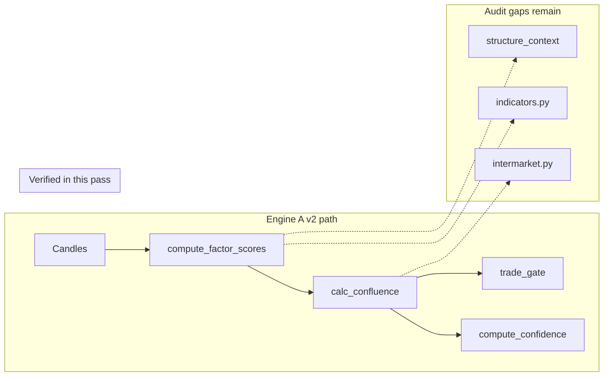

# Engine A Factor Scoring Audit — Verified Findings

**Date:** 2026-06-01  
**Scope:** Engine A v2 (`factor_scoring.py`, `scoring.py`, `engine_a_trade_gate.py`, related config)  
**Method:** Line-by-line verification against current repo source and `config.yaml`  
**Original audit verdict:** PASS WITH GAPS  
**Verified verdict:** **PASS WITH GAPS — mostly accurate**, with 3 material errors corrected below

---

## Summary

The submitted audit correctly traces the data flow from input candles through `compute_factor_scores` → `calc_confluence` → trade eligibility. No execution-gate bypass was found in the Engine A v2 code path itself. Most tunables, dead-code paths, misleading comments, and asymmetric clamps are real.

**Material corrections to the original audit:**

| ID | Original claim | Verified outcome |
|----|----------------|------------------|
| **DM1** | Regime floor logic is inverted (noisy regime raises scores) | **REJECTED** — math and tests confirm correct skepticism |
| **T6** | Forex EMA-cluster diagnostics run on non-forex assets | **REJECTED** — gated to `asset_type == "forex"` only |
| **CF1** | XAU/XAG pair override 1.5 beats group threshold 1.7 | **REJECTED for production** — group config wins; override is fallback-only dead code |

---

## Data flow (verified)



---

## Rejected findings (with evidence)

### DM1 — Regime floor inversion — **REJECTED** (was high)

**Original claim:** `_apply_regime_floor_sensitivity` lowers the conviction floor in RANGING/HIGH_VOLATILITY, which *raises* final score for the same conviction — opposite of “noisy-regime skepticism.”

**Actual math:**

```
final_multiplier = floor + (1 - floor) * conviction
```

For any `conviction < 1`, **lower floor → lower multiplier** (partial derivative `1 - conviction > 0`).

Example (conviction = 0.5):

- floor = 0.22 → multiplier = 0.61  
- floor = 0.10 → multiplier = 0.55  

**Repo intent matches code:** Tests require stock/index/crypto floors drop to 0.10 in noisy regimes so weak momentum counts less (`tests/test_factor_scoring.py:1427-1472`, `config.yaml:504-514`).

**Revised status:** No issue. Behavior is correct. Optional: add one-line formula comment in code.

---

### T6 — Non-forex EMA-cluster diagnostics — **REJECTED** (was low)

**Original claim:** `_forex_ema_cluster_diagnostics` runs for non-forex assets and wastes CPU.

**Actual:** Call is gated:

```python
if asset_type == "forex" and bool(CONFIG.get("ENGINE_A_FOREX_EMA_CLUSTER_DIAGNOSTICS_ENABLED", True)):
    trend_detail.update(_forex_ema_cluster_diagnostics(...))
```

(`factor_scoring.py:2872-2875`)

**Revised status:** No issue for non-forex.

---

### CF1 — XAU/XAG threshold asymmetry — **REJECTED for production** (was medium)

**Original claim:** `_PAIR_OVERRIDES` sets XAU/XAG to 1.5, below `precious_trackers` group threshold 1.7, so pair override wins.

**Actual resolution order** in `get_score_threshold` (`scoring.py:253-316`):

1. `_configured_score_threshold` — `ENGINE_A_PAIR_THRESHOLDS` → `ENGINE_A_SCORE_GROUP_THRESHOLDS[score_group]` → `default`
2. Only if step 1 returns `None`: `_get_threshold_tier` / `_PAIR_OVERRIDES`

Current config: `ENGINE_A_PAIR_THRESHOLDS: {}`, `precious_trackers: 1.7` → **XAU/XAG threshold is 1.7 in production**.

**Revised finding (low):** `_PAIR_OVERRIDES` is stale fallback-only dead code. Remove or sync to 1.7 to avoid confusion if group config is ever removed.

---

## Corrected findings (precision adjustments)

### AD1 — Crypto combo cap asymmetry — **CORRECTED**

**Original:** Weighted blend caps at [+0.20, −0.20] per single signal.

**Corrected:** Non-combo weighted blend clamps to `_ADDON_CONFIRM = 0.20` / `_ADDON_AGAINST = −0.15` (code defaults; not overridden in `config.yaml`). Same-side combo path uses `FACTOR_CRYPTO_ADDON_COMBO_CONFIRM_CAP: 0.25` / `FACTOR_CRYPTO_ADDON_COMBO_AGAINST_CAP: −0.20`. Asymmetry is real but magnitudes differ by path.

**Severity:** medium (unchanged)

---

### A3 — ADX missing vs hard abort reason — **CORRECTED**

**Original:** Reason conflates data unavailability with threshold breach.

**Corrected:** `feed_status["adx"]` and result `adx_source` already distinguish `"missing_both_abort"`. Only `abort_reason` is always `"adx_hard_abort"` (including missing-both). Test codifies this (`tests/test_factor_scoring.py:199-210`).

**Severity:** high (unchanged) — fix should split `abort_reason` or document as intentional contract.

---

### C2 — Addon unsupported split math — **CORRECTED**

**Original example:** stock split 0.5 → base=0.31, mom=0.59.

**Corrected:** With code defaults (base=0.20, addon=0.30, momentum=0.50) and `ENGINE_A_ADDON_UNSUPPORTED_SPLIT_BY_CLASS.stock: 0.55`:

- effective base = 0.20 + 0.30 × 0.55 = **0.365**
- effective momentum = 0.50 + 0.30 × 0.45 = **0.635**

Per-class weight overrides (e.g. `us_stock_single`) change these further.

**Severity:** low (unchanged)

---

### DM5 — Volatility scaler comment — **CORRECTED**

**Original:** Config has no `nat_gas` or `crypto_doge` entries in `VOLATILITY_SCALER_BANDS`.

**Corrected:** Comment at `factor_scoring.py:2985-2988` is overspecific. Config has `commodity` + score-group overrides (`precious_trackers`, `energy_oil`). `nat_gas` score_group falls through to `commodity` asset_type band via `_resolve_class_keyed`. Behavior works; comment is stale.

**Severity:** low (unchanged)

---

### T3 — Single-TF coverage cap opacity — **CORRECTED**

**Original:** Add comment explaining single-TF max magnitude.

**Corrected:** Comment already present at `factor_scoring.py:585-587` (“D1 only → max 1.0; D1+H4 → max 2.0; all three → max 3.0”). Finding downgraded to informational only.

**Severity:** none (doc-complete)

---

## Full findings table

Status: **confirmed** | **corrected** | **rejected**  
Severity: original unless adjusted in Notes.

### 1. Trend (Factor 1)

| ID | Status | Sev | Anchor | Issue | Minimal fix | Notes |
|----|--------|-----|--------|-------|-------------|-------|
| T1 | confirmed | medium | `factor_scoring.py:454-654` | Legacy `_coherent_trend_score_legacy` and profile `_coherent_trend_score_from_profile` duplicate multi-TF EMA vote. Profile on by default (`scoring_profile_enabled()` defaults True; `config.yaml` `ENGINE_A_SCORING_PROFILE.ENABLED: true`). Legacy path effectively dead in production. | Gate legacy behind `scoring_profile_enabled() is False` or delete. | Drift risk if both maintained. |
| T2 | confirmed | low | `factor_scoring.py:466,519-522`; `engine_a_scoring_profile.py:25-29` | `_STYLE_TREND_WEIGHTS` and `INDICATOR_WEIGHTS.trend.*` are separate stacks; legacy always reads `INDICATOR_WEIGHTS`. | Assert or comment that legacy ignores style. | |
| T3 | corrected | — | `factor_scoring.py:588-598` | Single-TF coverage cap logic is opaque. | — | Comment already at 585-587. No action needed. |
| T4 | confirmed | low | `factor_scoring.py:657-702` | Hysteresis cache key uses `len(candles)` + `candles[-2]['close']`; in-place candle append can stale-hit. Unbounded process-global dict; not thread-safe. | Thread lock or proper LRU eviction. | `_PREV_SNAP_CACHE_MAX=200` with FIFO eviction exists. |
| T5 | confirmed | medium | `factor_scoring.py:477-493`; `config.yaml:555-579` | Trend vote hardcodes ema21/ema200/ema50; `ENGINE_A_EMA_PERIODS_BY_CLASS` not wired into vote layer. Per-class periods affect indicators only. | Feed periods into vote layer or rename config scope. | Profile `DEFAULT_BY_CLASS` layers also hardcode EMA keys. |
| T6 | rejected | — | `factor_scoring.py:2872-2875` | Diagnostics run for non-forex. | — | Gated to forex only. |

### 2. Momentum quality (Factor 2)

| ID | Status | Sev | Anchor | Issue | Minimal fix | Notes |
|----|--------|-----|--------|-------|-------------|-------|
| M1 | confirmed | medium | `factor_scoring.py:898-1025` | Final momentum clamped to [0,1]; opposing MACD (−0.25 × 0.4 → rescaled −0.20) floors to 0. Engine never penalizes below neutral via momentum alone. | Signed momentum or document non-negative semantics. | Docstring at 1012-1013 documents this. |
| M2 | confirmed | low | `factor_scoring.py:975-986` | `volume_momentum_score` only when group adjustments on and weight > 0. Silent behavior change on/off. | Explicit flag or document. | |
| M3 | confirmed | medium | `factor_scoring.py:941-953` | RSI divergence skipped when `len(h4_candles) < 35`; no feed_status flag. | `feed_status["rsi_divergence"] = "insufficient_history"`. | |
| M4 | confirmed | low | `factor_scoring.py:813-863` | StochRSI modifier ±0.10 on different scale than momentum [0,1]. | Config-key scale if enabled. | Gated off in config. |
| M5 | confirmed | low | `factor_scoring.py:866-906` | RSI bounds via score_group/asset_type; no per-display override. | Per-display resolver if needed. | |

### 3. ADX gate (Factor 3)

| ID | Status | Sev | Anchor | Issue | Minimal fix | Notes |
|----|--------|-----|--------|-------|-------------|-------|
| A1 | confirmed | medium | `factor_scoring.py:1354-1388` | Hardcoded ADX fallbacks; per-process-once warning may miss later missing classes. | Per-class warning cache. | Fallbacks dead when config complete. |
| A2 | confirmed | medium | `factor_scoring.py:1391-1395` | `_range <= 0` → binary 1.0/0.0; config typo could trigger silently. | Log when `_range <= 0`. | `hard_fail = trend_min - 5.0` guard exists. |
| A3 | corrected | high | `factor_scoring.py:1851-1855,2878-2883` | Missing ADX abort uses `abort_reason="adx_hard_abort"`. | Split `abort_reason` or document contract. | `adx_source` / `feed_status["adx"]` already `"missing_both_abort"`. |
| A4 | confirmed | low | `factor_scoring.py:1334-1351` | `max` mode tie-break: equal D1/H4 → D1 wins. | Document tie-break. | |
| A5 | confirmed | low | `factor_scoring.py:1518-1553` | `adx_falling` from slope OR value comparison; redundant signals. | Pick one definition or rename. | |
| A6 | confirmed | low | `config.yaml:258-305` | Crypto ADX bands lack inline backtest provenance. | Add provenance comments. | |

### 4. Asset addon

| ID | Status | Sev | Anchor | Issue | Minimal fix | Notes |
|----|--------|-----|--------|-------|-------------|-------|
| AD1 | corrected | medium | `factor_scoring.py:2364-2386` | Crypto same-side combo cap +0.25 vs confirm +0.20; asymmetric reward. | Symmetric caps or document. | Non-combo against cap is −0.15 default, not −0.20. |
| AD2 | confirmed | medium | `factor_scoring.py:2388-2399` | COT-unsupported commodities return 0.0; no volume-addon fallback. | Volume fallback for COT-unsupported with volume data. | `ASSET_TYPES` excludes commodity. |
| AD3 | confirmed | medium | `factor_scoring.py:2401-2407` | Duplicated volume-addon type check. | Extract helper. | |
| AD4 | confirmed | medium | `factor_scoring.py:1864-1981` | Carry/COT/funding thresholds hardcoded (0.5, 1.0, 0.0001). | Move to config keys. | |
| AD5 | confirmed | low | `factor_scoring.py:2360-2362,2176-2255` | Forex COT only via ortho path when `ENGINE_A_ORTHO_VOTE_ENABLED=true` (off). | Remove dead path or config note. | |
| AD6 | confirmed | low | `factor_scoring.py:42` | `_CRYPTO_COT_PAIRS` never referenced. | Remove or wire. | |
| AD7 | confirmed | medium | `factor_scoring.py:2924-2935` | Engine B RL cap uses global flag, not per-pair activation. | Per-pair gate. | |
| AD8 | confirmed | low | `factor_scoring.py:1930-1934` | `_cot_formula_supported` swallows exceptions. | Debug log on first exception. | |

### 5. Conviction blend & weights

| ID | Status | Sev | Anchor | Issue | Minimal fix | Notes |
|----|--------|-----|--------|-------|-------------|-------|
| C1 | confirmed | medium | `factor_scoring.py:2900-2955,3076-3088` | Ortho mode: addon computed/clamped but `_eff_addon_w=0`; clamp dead for conviction. | Move clamp into non-ortho branch. | |
| C2 | corrected | low | `factor_scoring.py:3063-3074` | Addon unsupported split math non-obvious. | Document effective weights. | stock split 0.55 → base≈0.365, mom≈0.635. |
| C3 | confirmed | medium | `factor_scoring.py:3058-3059,3162-3188` | Cost penalty forex+crypto only; not class-keyed in docs. | Document scope. | |
| C4 | confirmed | low | `factor_scoring.py:3100` | Conviction clamped [0,1] before floor blend. | Document as intentional. | |

### 6. Directional ramp / DI / cost / vol / session

| ID | Status | Sev | Anchor | Issue | Minimal fix | Notes |
|----|--------|-----|--------|-------|-------------|-------|
| DM1 | rejected | — | `factor_scoring.py:138-160,3131-3137` | Regime floor lowers scores incorrectly. | — | Math correct; tests confirm skepticism. |
| DM2 | confirmed | medium | `factor_scoring.py:3005-3031` | Missing DI penalty 0.5 default; forex override missing=1.0 only. | Per-class missing-DI behavior. | |
| DM3 | confirmed | medium | `factor_scoring.py:3162-3164` | Funding penalty at fr>0.01 (100 bps/8h); effectively dead in normal crypto. | Rename key for unit clarity. | |
| DM4 | confirmed | low | `factor_scoring.py:3171-3188` | Duplicate carry lookups for addon vs cost penalty. | Single cached lookup. | |
| DM5 | corrected | low | `factor_scoring.py:2985-2988` | Comment references nat_gas/crypto_doge band entries not in config. | Fix comment. | Falls through to commodity band. |
| DM6 | confirmed | medium | `factor_scoring.py:2992-2994` | Session mult disabled but still called. | Conditional call or remove. | Returns 1.0. |
| DM7 | confirmed | medium | `factor_scoring.py:2996-2998` | Comment says equity session default-off; config has ENABLED: true. | Fix comment. | ±2% nudge active. |
| DM8 | confirmed | low | `factor_scoring.py:2688-2693` | UTC wrap-around path untested. | Unit test for wrap case. | |

### 7. Research lab (addon)

| ID | Status | Sev | Anchor | Issue | Minimal fix | Notes |
|----|--------|-----|--------|-------|-------------|-------|
| RL1 | confirmed | medium | `factor_scoring.py:1062,1100-1132` | Legacy factor names callable via config; no fail-closed allowlist. | Maintained allowlist in `_research_factor_value`. | |
| RL2 | confirmed | low | `factor_scoring.py:1262-1281` | Bollinger math duplicated in three places. | Use `indicators.calc_bollinger`. | |
| RL3 | confirmed | medium | `factor_scoring.py:1049-1055` | Hardcoded 60-bar minimum; silent H4 fallback. | Configurable per-factor minimum. | |
| RL4 | confirmed | low | `factor_scoring.py:1141-1147` | OBV signal naming confusing vs logic. | Rename to `obv_trend_label`. | Logic correct. |
| RL5 | confirmed | low | `factor_scoring.py:2916-2918` | feed_status lacks per-factor breakdown. | Add `research_lab_components`. | Detail in `factor_scores["research_lab"]`. |

### 8. Mean reversion, VWAP, late-trend, EMA cluster

| ID | Status | Sev | Anchor | Issue | Minimal fix | Notes |
|----|--------|-----|--------|-------|-------------|-------|
| MR1 | confirmed | low | `factor_scoring.py:2491-2582` | Disabled mean reversion leaves no feed_status entry. | Always record `"disabled"`. | |
| MR2 | confirmed | low | `factor_scoring.py:2558-2561` | Z-score/RSI thresholds hardcoded. | Config or document. | |
| VW1 | confirmed | medium | `factor_scoring.py:2422,2444` | Docstring says session-anchored VWAP; implementation is rolling H4 lookback. | Rename or implement session anchor. | |
| VW2 | confirmed | medium | `factor_scoring.py:2437-2438` | Latest H4 bar may be unfinalized in live mode. | Require finalized bar. | |
| LT1 | confirmed | low | `factor_scoring.py:1796-1821` | Late-trend short-circuit: ADX before volume. | Reorder checks. | |
| LT2 | confirmed | low | `factor_scoring.py:1700-1708` | Sparse volume → MA unavailable → volume_below_ma never fires. | Default pessimistic when MA missing. | |
| EC1 | confirmed | low | `factor_scoring.py:1556-1611` | soft_cap vs multiplier modes; config uses multiplier. | Remove dead path or document. | |
| EC2 | confirmed | low | `factor_scoring.py:1572-1577` | full_alignment requires 3 TFs + coherence 1.0. | Consider agreement_count >= 2. | |

### 9. Confluence routing (`scoring.py`)

| ID | Status | Sev | Anchor | Issue | Minimal fix | Notes |
|----|--------|-----|--------|-------|-------------|-------|
| CF1 | rejected | low* | `scoring.py:247-250,283-286` | XAU/XAG 1.5 override beats 1.7 group threshold. | Remove stale `_PAIR_OVERRIDES`. | *Revised: dead code only; production uses 1.7. |
| CF2 | confirmed | medium | `scoring.py:321-324` | `allow_lower_threshold` opt-in silent. | Log when used. | |
| CF3 | confirmed | — | `scoring.py:343-358` | Defensive regime parsing. | OK. | |
| CF4 | confirmed | low | `scoring.py:375-434` | H4 ADX not surfaced when factor ADX present. | Audit exposure if needed. | Fix aligned for trendState. |
| CF5 | confirmed | low | `scoring.py:565-635` | `CORR_CLUSTERS` hardcoded. | Move to config. | |
| CF6 | confirmed | low | `scoring.py:116-192` | New instruments fall to `*_other` catch-all. | Configurable default thresholds. | |
| CF7 | confirmed | low | `scoring.py:899-906` | `or 0` on final_score intent unclear. | Use `or 0.0` or drop. | Harmless. |
| CF8 | confirmed | low | `scoring.py:907-930` | Legacy votes dict fragile naming. | Document or deprecate. | |
| CF9 | confirmed | low | `scoring.py:1011-1056` | factorDiagnostics flat, no schema. | TypedDict/Pydantic. | |
| CF10 | confirmed | low | `scoring.py:1061-1082` | Calibration diagnostic errors at debug only. | Warning level. | |
| CF11 | confirmed | medium | `scoring.py:1236-1299` | `BACKTEST_RUNNING` global may relax live gates. | Thread-local or per-request scope. | |

### 10. Trade-eligibility gate

| ID | Status | Sev | Anchor | Issue | Minimal fix | Notes |
|----|--------|-----|--------|-------|-------------|-------|
| TE1 | confirmed | medium | `engine_a_trade_gate.py:80-110` | Manual enable without runtime evidence re-check. | Document opt-in or auto-disable. | |
| TE2 | confirmed | low | `engine_a_trade_gate.py:17-33` | Permissive bool coercion. | Fail loud on unknown values. | |
| TE3 | confirmed | low | `engine_a_trade_gate.py:84-87` | Override consumption not logged. | Audit log when override applies. | |

### Cross-cutting

| ID | Status | Sev | Anchor | Issue | Minimal fix | Notes |
|----|--------|-----|--------|-------|-------------|-------|
| X1 | confirmed | high | `factor_scoring.py:3698`; `scoring.py:971-979` | Hard abort returns empty `filtered_indicators`; confidence can be non-zero from regime/session/TF proxies. | Short-circuit confidence to 0.0 on hard abort. | |
| X2 | confirmed | medium | `factor_scoring.py:3368-3370` | Intermarket exception at debug only. | Warning or feed_status error. | |
| X3 | confirmed | medium | `factor_scoring.py:3420-3435` | Structure context failure → duplicate error states. | Consolidate error path. | |
| X4 | confirmed | low | `factor_scoring.py:3307-3312` | Mean reversion additive then clamp order. | Document order. | |
| X5 | confirmed | medium | `factor_scoring.py:2900-2973` | feed_status uses formatted strings; raw floats not recoverable. | Structured factor_breakdown dict. | |
| X6 | confirmed | medium | `factor_scoring.py:3313-3314` | EMA cluster soft cap not exposed on final_score. | Add cap fields to result. | |
| X7 | confirmed | low | `factor_scoring.py:3536` | addon_unsupported boolean lacks type. | Use feed_status["addon"] as source. | |
| X8 | confirmed | medium | `factor_scoring.py:3679-3681` | Multiple boolean abort flags vs single enum. | Add `signal_status` enum. | |

---

## New findings (not in original audit)

| ID | Sev | Issue | Minimal fix |
|----|-----|-------|-------------|
| **N1** | medium | **`abort_reason` taxonomy:** Distinct ADX failures (hard fail vs missing-both) share `adx_hard_abort`. Tests codify current behavior. | Document as intentional contract or split reasons. |
| **N2** | low | **Threshold dead code:** `_PAIR_OVERRIDES` and 3-tier `_get_threshold_tier` largely superseded by `ENGINE_A_SCORE_GROUP_THRESHOLDS` when populated (current config). | Remove or sync stale overrides. |
| **N3** | medium | **Profile vs period resolver split:** `ENGINE_A_EMA_PERIODS_BY_CLASS` affects indicator computation; profile `trend_layers` in config hardcode EMA field names — two calibration surfaces that can drift. | Wire periods into profile layers or document single source of truth. |
| **N4** | info | **Local config overlay:** `config.local.yaml` sets `PAPER_SOAK.REAL_ORDERS_ALLOWED: true` for demo routing. Not Engine A logic but affects live behavior surface. | Keep local overlay out of repo commits. |

---

## Coverage gaps (unchanged — not verified line-by-line)

- **`indicators.py`** — `calc_rsi_divergence`, `calc_obv_trend`, `calc_stochastic_rsi`, `calc_vwap`, `chandelier_exit`, `calc_ema`, `calc_sma`, `calc_aroon` called but internals not audited
- **`intermarket.apply_confirmation_to_score`** — silent error path at `factor_scoring.py:3368-3370`; effect could be absent without surfacing
- **`athena_app.services.structure_context`** — correlated overlay guard max-uplift logic unverified
- **Backtest parity** — `_a_only_required_score` vs live `combinedConviction` not tested
- **Indicator field names** — `plusDI` vs `plus_di`, `macdHist` vs `macd_hist`, etc.; fallback chains not traced into `indicators.py`

---

## Improvements (non-issue suggestions — retained from original)

- Score cap asymmetry backtest: AD1 symmetric vs asymmetric caps  
- DM1 backtest hypothesis — **withdrawn** (original DM1 finding rejected; logic is correct)  
- Add n≥30 evidence gate to trade-enabled map (TE1)  
- Migrate addon thresholds to config (AD4)  
- Consolidate Bollinger math (RL2)  
- Replace `vote_sign` tri-state with typed enum  
- Engine A → Engine C contract test (deterministic pin)  
- Profile partial-override semantics in `engine_a_scoring_profile.py`  
- Forex EMA-cluster partial alignment (EC2)  
- Live bar finalization (VW2)  
- Boot sanity: `ENGINE_A_KNOWN_SCORE_GROUPS ⊆ ENGINE_A_SCORE_GROUP_THRESHOLDS.keys()`  
- Document 3.0 cap × conviction scale interaction  

---

## Priority fix backlog (implementation — not done in this pass)

### High

1. **X1** — Force `confidence=0.0` (or skip `compute_confidence`) on hard-abort paths  
2. **AD2** — Volume-addon fallback for COT-unsupported commodities with EODHD volume  
3. **A3 / N1** — Split `abort_reason` for missing ADX vs below hard-fail, or document contract  

### Medium

4. **AD1** — Document or symmetrize crypto combo caps  
5. **T1** — Gate or remove legacy trend path  
6. **T5 / N3** — Wire `ENGINE_A_EMA_PERIODS_BY_CLASS` into trend vote layer  
7. **CF11** — Scope `BACKTEST_RUNNING` / `RESEARCH_MODE` per request  

---

## Files inspected

| File | Scope |
|------|-------|
| `factor_scoring.py` | Full (~3700 lines) — trend, momentum, ADX, addon, conviction, zero path |
| `engine_a_scoring_profile.py` | Full |
| `scoring.py` | Threshold routing, confidence call, confluence (partial) |
| `engine_a_trade_gate.py` | Full |
| `confidence_engine.py` | `compute_confidence`, component redistribution |
| `config.yaml` | ADX, session, equity session, COT/volume addon, thresholds, scoring profile |
| `config.local.yaml` | PAPER_SOAK overlay |
| `tests/test_factor_scoring.py` | ADX missing, regime floor, zero result |

## Tests run

None (documentation-only deliverable).

## Remaining risks

- Intermarket and structure-context modules' error paths and behavior  
- Indicator suite field-name contracts and computation correctness  
- Live vs backtest threshold / conviction parity under edge configs  
- Local `config.local.yaml` demo order routing is active in developer environments  

---

*Generated by repo verification pass 2026-06-01. Original audit reviewed and corrected item-by-item against current source.*
